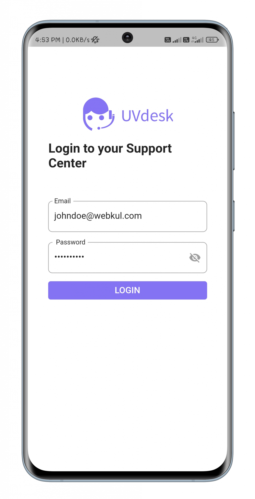
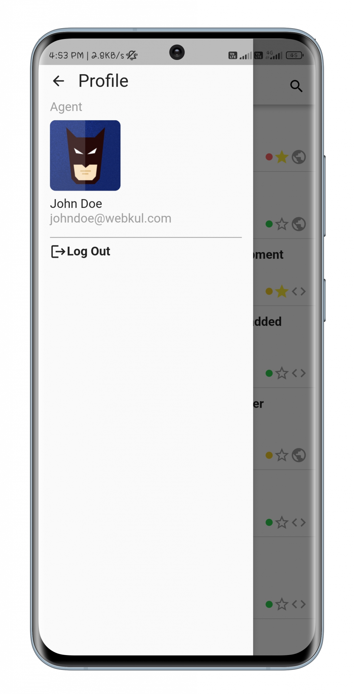
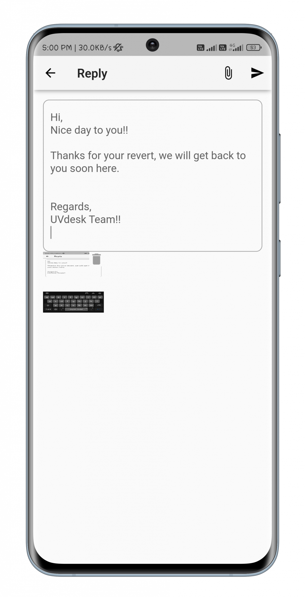
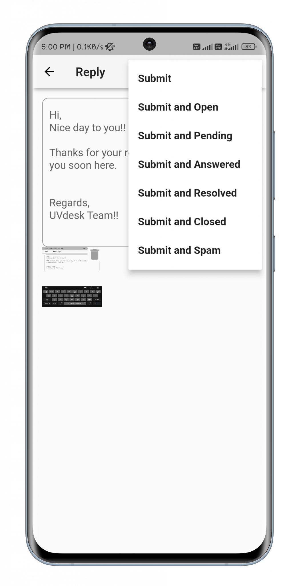
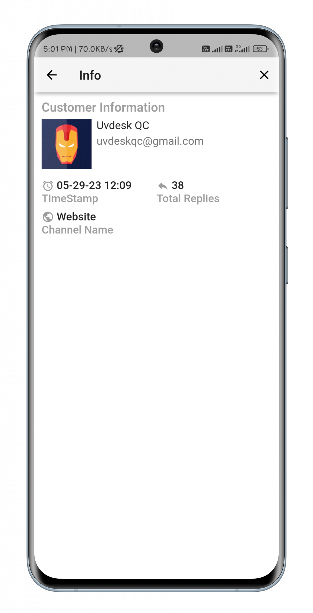

# uv_desk_flutter_open_source

A new Flutter project.

## Getting Started

This project is a starting point for a Flutter application.

A few resources to get you started if this is your first Flutter project:

- [Lab: Write your first Flutter app](https://docs.flutter.dev/get-started/codelab)
- [Cookbook: Useful Flutter samples](https://docs.flutter.dev/cookbook)

For help getting started with Flutter development, view the
[online documentation](https://docs.flutter.dev/), which offers tutorials,
samples, guidance on mobile development, and a full API reference.

## Running this code
After Downloading this package, unzip the package and import in your favorite IDE. 
Preferred IDES 
- [Android Studio](https://developer.android.com/studio)
- [Visual Studio Code](https://code.visualstudio.com/)

After importing this package, run flutter pub get in the terminal of your IDE.

## Configuring the CODE
The below mentioned files will help you with the configuration of the code.
- [server_configuration.dart](https://github.com/uvdesk/mobile_app/blob/main/lib/mobikul-uvdesk/configuration/server_configuration.dart)
  Change the three variables baseUrl , demoUserName , demoPassword as per your use.
- [mobikul_theme.dart](https://github.com/uvdesk/mobile_app/blob/main/lib/mobikul-uvdesk/configuration/mobikul_theme.dart)
  Change the colors as per your need.

## Complete user guide
To read more about the features of the app, please visit the article [here](https://www.uvdesk.com/en/blog/uvdesk-open-source-flutter-mobile-app/)

## App Screenshots

# Login Screen

# Agent Profile View

# Ticket List View

# Ticket Details View

# Ticket Reply View

# Ticket Status Update View

# Ticket Activity View

# Customer Information View

